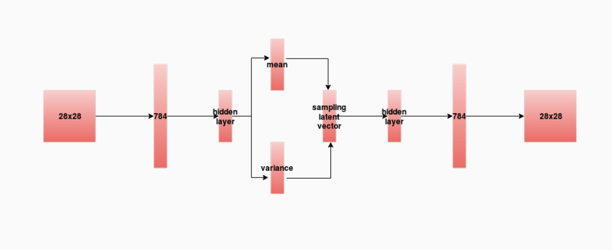
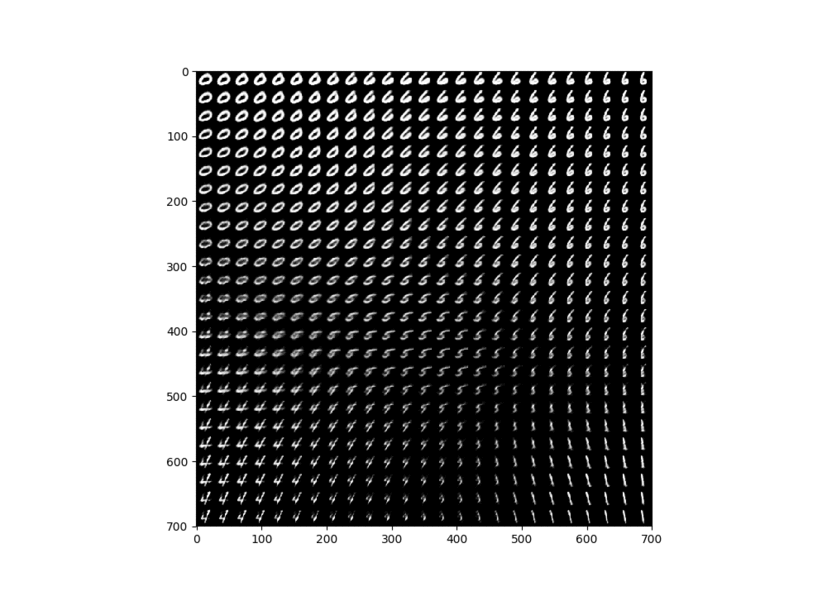
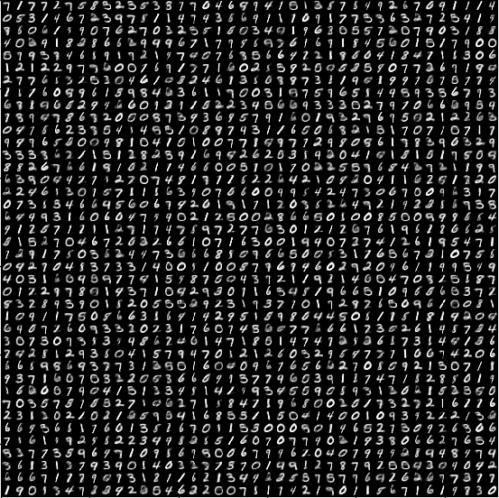
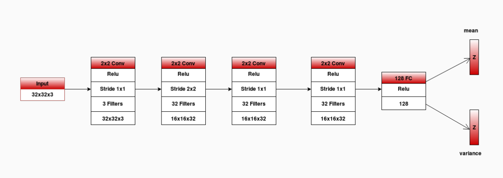
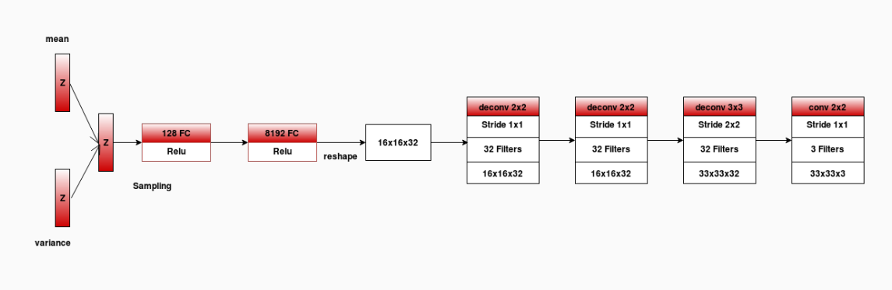
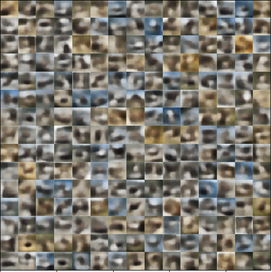
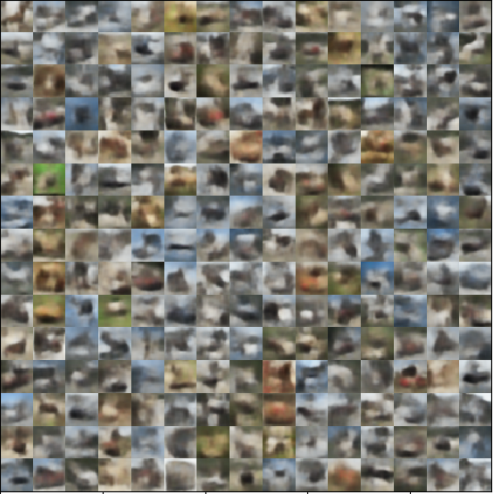
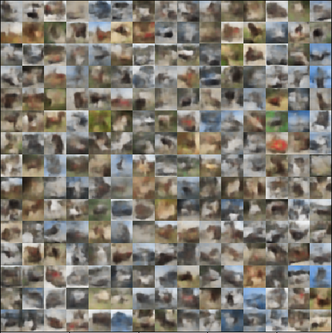
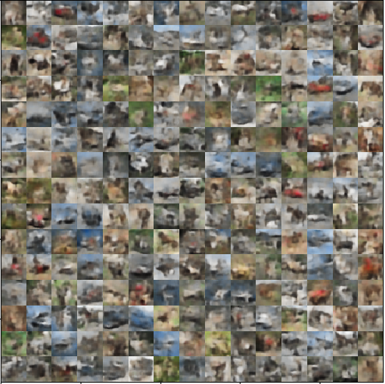

# VAE for Image Generation
Variational AutoEncoder - Keras implementation on mnist and cifar10 datasets

## Dependencies
- keras
- tensorflow / theano (current implementation is according to tensorflow. It can be used with theano with few changes in code)
- numpy, matplotlib, scipy

## implementation Details
code is highly inspired from keras examples of vae : ,
  
(_source files contains some code duplication_)

### MNIST

- images are flatten out to treat them as 1D vectors
- encoder and decoder - both have normal neural network architecture

| network architecture |
| -- |
|  |

##### 
- it trains vae model according to the hyperparameters defined in 
- entire vae model, encoder and decoder is stored as keras models in  directory as `ld_<latent_dim>_id_<intermediate_dim>_e_<epochs>_<vae/encoder/decoder>.h5` where `<latent_dim>` is number of latent dimensions, `<intermediate_dim>` is number of neurons in hidden layer and `<epochs>` is number of training epochs
- after training, the saved model can be used to analyse the latent distribution and to generate new images
- it also stores the training history in `ld_<latent_dim>_id_<intermediate_dim>_e_<epochs>_history.pkl`

##### 
- it is only for 2 dimensional latent space
- it loads trained model according to the hyperparameters defined in `mnist_params.py`
- it displays the latent space distribution and then generates the images according to user input of latent variables (see the code as it is almost self-explanatory)
- it can also generate images from latent vectors randomly sampled from 2D latent space (comment out the user input lines) and display them in a grid

##### 
- it is same as `mnist_2d_latent_space_and_generate.py` but it is for 3d latent space

##### 
- it loads trained model according to the hyperparameters defined in `mnist_params.py`
- if latent space is either 2D or 3D, it displays it
- it displays a grid of images generated from randomly sampled latent vectors

#### results

##### 2D latent space
| latent space | uniform sampling |
| -- | -- |
|  |  |
##### 3D latent space

##### 3D latent space results
| uniform sampling | random sampling |
| -- | -- |
|  |  |

- more results are in  directory

### CIFAR10

- images are treated as 2D input
- encoder has the architecture of convolutional neural network and decoder has the architecture of deconvolutional network
- network architecture for encoder and decoder are as follows  
  
| encoder |
| -- |
|  |  

| decoder |
| -- |
|  |

#####  , 
implementation structure is same as mnist files

#### result - latent dimensions 16
| 25 epochs | 50 epochs | 75 epochs |
| -- | -- | -- |
|  |  |  |

| 600 epochs |
| -- |
|  |

### CALTECH101

- `caltech101_<sz>_train.py` and `caltech101_<sz>_generate.py` (where `sz` is the size of input image - here the training was done for two sizes - 92\*92 and 128\*128) are same as cifar10 dataset files
- as the image size is large, more computation power is needed to train the model
- results obtained with less training are qualitatively not good
- in `dataset` directory,  is provided to preprocess the dataset
